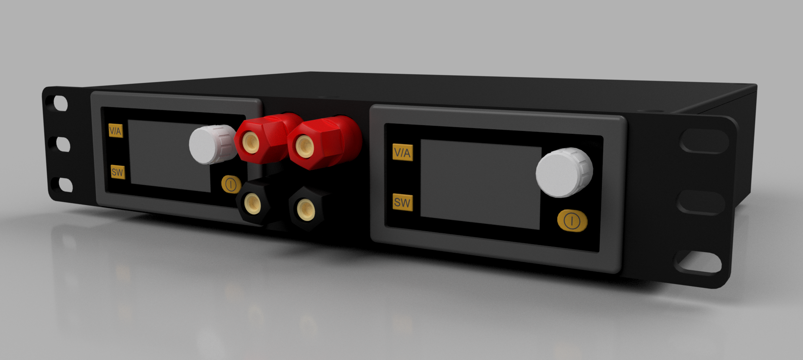
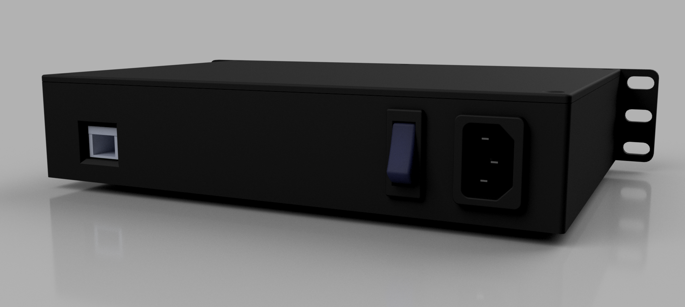
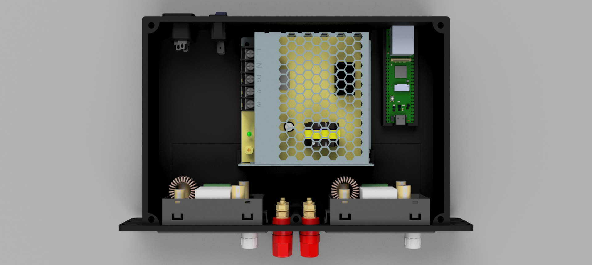
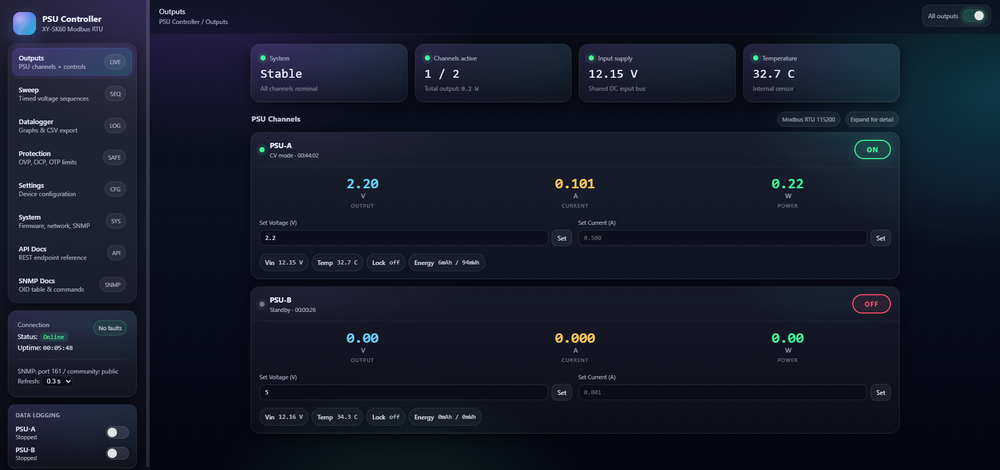

# XY-SK60 / XY-SK120 Dual PSU Controller

**Open-source remote control and automation system for dual Sinilink XY-SK60/SK120 buck-boost power supplies — built around a Luckfox RV1106 SoC in a 10-inch 1U rack enclosure.**

[](LICENSE-AGPL)
[](LICENSE-CC-BY-NC-SA)

---

## Table of Contents

- [Project Overview](#project-overview)
- [Hardware](#hardware)
  - [PSU Modules](#psu-modules-sinilink-xy-sk60--xy-sk120)
  - [Controller: Luckfox Pico Plus](#controller-luckfox-pico-plus-rv1106)
  - [Serial Interface & Wiring](#serial-interface--wiring)
  - [Enclosure](#enclosure)
- [Software Architecture](#software-architecture)
- [Web UI](#web-ui)
  - [Outputs](#outputs)
  - [Protection](#protection)
  - [Settings](#settings)
  - [Sweep](#sweep)
  - [Datalogger](#datalogger)
  - [API Docs / SNMP Docs / System Info](#api-docs--snmp-docs--system-info)
- [REST API](#rest-api)
- [SNMP Agent](#snmp-agent)
- [Deployment](#deployment)
  - [Prerequisites](#prerequisites)
  - [Windows Deployment](#windows-deployment-pscp--plink)
  - [Linux / macOS Deployment](#linux--macos-deployment)
  - [Manual Deployment](#manual-deployment)
  - [Service Management](#service-management)
- [Configuration](#configuration)
- [Typical Use Cases](#typical-use-cases)
- [License](#license)
- [Contact](#contact)
- [Contributing](#contributing)

---

## Project Overview

This project turns two off-the-shelf Sinilink XY-SK60 or XY-SK120 buck-boost modules into a fully networked, rack-mounted lab power system. A Luckfox Pico Plus SBC (RV1106 SoC, running Linux) sits between the PSUs and the network, communicating with each PSU over Modbus RTU via dedicated UARTs and exposing a feature-rich control interface.

**What you get:**

| Capability | Detail |
|---|---|
| Web dashboard | Real-time V/I/P telemetry, output control, protection config, settings |
| Voltage sweep | Timed voltage sequences — define waypoints, upload, start/stop |
| Datalogger | Per-channel V/I/P time-series, live graph, CSV export |
| REST API | Full JSON API for scripting and automation |
| SNMP agent | SNMPv2c for integration with Zabbix, Nagios, LibreNMS, etc. |
| 10-inch 1U rack | 3D-printable enclosure, all files included |

---

## Hardware

### PSU Modules: Sinilink XY-SK60 / XY-SK120

The Sinilink XY-SK60 and XY-SK120 are synchronous buck-boost DC-DC converter modules with an onboard microcontroller, LCD display, and a serial (Modbus RTU) control port.

| Parameter | XY-SK60 | XY-SK120 |
|---|---|---|
| Input voltage | 8 – 60 V DC | 8 – 60 V DC |
| Output voltage | 1 – 60 V DC | 1 – 60 V DC |
| Max output current | 6 A | 12 A |
| Max output power | 60 W | 120 W |
| Conversion efficiency | up to 98% | up to 98% |
| Display | colour LCD | colour LCD |
| Serial interface | UART 115200 8N1 | UART 115200 8N1 |
| Control protocol | Modbus RTU (slave addr 1) | Modbus RTU (slave addr 1) |

Both variants expose identical register maps and are fully interchangeable in this system. The modules have a 6-pin serial header exposing TX, RX, GND and 3.3 V.

The `doc/` folder contains the official SK60/SK120 user guide PDF with the full register map.

### Controller: Luckfox Pico Plus (RV1106)

The controller runs on a [Luckfox Pico Plus](https://www.luckfox.com/), a credit-card-sized Linux SBC based on the Rockchip RV1106 SoC.

| Parameter | Value |
|---|---|
| SoC | Rockchip RV1106 (ARM Cortex-A7, 1.2 GHz) |
| RAM | 64 MB DDR2 |
| Storage | 8 MB SPI NOR flash (runs Linux from flash) |
| OS | BusyBox-based Linux |
| Network | 100 Mbit Ethernet |
| UARTs used | ttyS3 (PSU-B), ttyS4 (PSU-A) |

Any Linux SBC with two free UARTs and Ethernet will work as a drop-in replacement (Raspberry Pi Zero 2, Orange Pi Zero, etc.). Only the UART device paths in `config.json` need adjustment.

### Serial Interface & Wiring

Each PSU communicates at **115200 baud, 8N1, Modbus RTU** on a dedicated UART. The controller reads all live registers in a single burst (30 registers from address 0x00) and writes individual registers for commands.

```
PSU-A  ──TX──►  RV1106 ttyS4 RX
       ◄─RX──   RV1106 ttyS4 TX
       ──GND─   GND
       ──5V─    5 V (optional, but the PSU exposes an 5V supply pin on the UART header, can be used for powering the SoC)

PSU-B  ──TX──►  RV1106 ttyS3 RX
       ◄─RX──   RV1106 ttyS3 TX
       ──GND─   GND
```

The UARTs operate at 3.3 V logic. No level shifting is needed between the Luckfox and the PSU serial headers. Each UART is a point-to-point connection (no RS-485 bus required).

**Register address map (key registers):**

| Address | Name | Scale | Access |
|---|---|---|---|
| 0x0000 | V_SET — voltage setpoint | ÷ 100 → V | R/W |
| 0x0001 | I_SET — current limit | ÷ 1000 → A | R/W |
| 0x0002 | VOUT — output voltage | ÷ 100 → V | RO |
| 0x0003 | IOUT — output current | ÷ 1000 → A | RO |
| 0x0004 | POWER — output power | ÷ 100 → W | RO |
| 0x0005 | UIN — input voltage | ÷ 100 → V | RO |
| 0x000D | T_IN — internal temp | ÷ 10 → °C | RO |
| 0x0012 | ONOFF — output enable | 1=ON, 0=OFF | R/W |
| 0x0011 | CVCC — CV/CC mode | 0=CV, 1=CC | RO |
| 0x0010 | PROTECT — protection flags | bitmask | RO |

The full register map is in `src/psu_controller/modbus_psu.py` and the PSU user guide.

### Enclosure

The system is built into a **10-inch, 1U rack enclosure** that is fully 3D printable.

<p align="center">
  
  
</p>

<p align="center">
  
</p>

- **Form factor:** 1U × 10-inch rack (compatible with standard 10-inch patch panels and mini-racks)
- **3D files:** `3D files/` contains STEP models for the body, lid, and full assembly with internal components
- **Fastening:** designed for M3 hardware
- Both PSU modules mount inside the body, with the Luckfox mounted to the lid or rear panel

---

## Software Architecture

The controller software runs as a single Python process under a BusyBox init.d service (`/etc/init.d/S99psucontroller`). All files install to `/opt/psu_controller/`.

```
psu_controller.py          ← main entry point, wires everything together
│
├── modbus_psu.py           ← Modbus RTU driver (one instance per PSU)
│    ├── read_all()          — bulk-reads 30 registers in one transaction
│    ├── set_voltage(v)      — writes REG_V_SET
│    ├── set_current(i)      — writes REG_I_SET
│    ├── set_output(on)      — writes REG_ONOFF
│    └── get_readings_cached() — returns last polled values (thread-safe)
│
├── web_server.py           ← single-threaded HTTP server (BaseHTTPRequestHandler)
│    ├── GET  /              — serves index.html
│    ├── GET  /app.js etc    — serves static web assets
│    ├── GET  /api/...       — JSON API read endpoints
│    └── POST /api/...       — JSON API command endpoints
│
├── sweep_manager.py        ← per-PSU timed voltage/output sequencer
│    ├── set_program()       — validates and stores waypoint list
│    ├── start()             — launches sweep thread
│    ├── stop()              — signals thread to stop
│    └── _run()              — 50 ms loop; applies waypoint actions on step change
│
├── datalogger.py           ← per-PSU time-series ring buffer logger
│    ├── start(interval_ms)  — launches logging thread
│    ├── stop()              — signals thread to stop
│    ├── get_data()          — returns samples as list of {t, v, i, p} dicts
│    └── get_csv()           — returns CSV string (time_ms, voltage_V, current_A, power_W)
│
├── snmp_agent.py           ← SNMPv2c agent (raw UDP socket, port 161)
│    └── exposes 28 OIDs per PSU channel (reads, settings, protection thresholds)
│
├── config.json             ← serial ports, baud rates, web/SNMP bind addresses
│
└── web/
     ├── index.html          ← single-page application shell
     ├── app.js              ← all UI logic (vanilla JS, no framework)
     └── style.css           ← all styles (CSS variables, grid, dark theme)
```

**Threading model:**
- Main thread: starts all services, then blocks
- Web server thread: one persistent thread handles all HTTP requests serially
- SNMP thread: one persistent thread handles all UDP datagrams serially
- PSU polling thread (×2): each `ModbusPSU` instance runs its own background thread that continuously polls registers and caches the result
- Sweep thread (×2, on demand): one thread per PSU when a sweep is running
- Datalogger thread (×2, on demand): one thread per PSU when logging is active

All shared state is protected by `threading.Lock()`. The web server never touches serial hardware directly — it reads from caches and dispatches commands to the PSU driver.

---

## Web UI

Access the web interface at `http://[DEVICE_IP]:8080/`. The UI is a single-page application with no external dependencies. All pages share a persistent sidebar for navigation and datalogger status.

### Outputs

<p align="center">
  
</p>

The default page shows both PSU channels side by side (or stacked on narrow displays). For each channel:

- **Live readings** (refreshed every 300 ms): output voltage, current, power — displayed in large, colour-coded digits
- **Output toggle button**: green ON / grey OFF; reflects actual hardware state
- **CV/CC indicator**: shows whether the PSU is operating in constant-voltage or constant-current mode
- **Uptime counter**: accumulated output-on time (H:MM:SS)
- **Set Voltage / Set Current inputs**: type a value and press Set (or Enter). Inputs use `type="text"` to preserve partial input during polling; the placeholder shows the current setpoint. Inputs are fully stable during refresh — focus, cursor position, and text selection are never disturbed by background polling.
- **Info chips**: input voltage, internal temperature, key lock state, accumulated energy (mAh / mWh), and protection alert if active

### Protection

Per-channel protection threshold configuration:

| Setting | Description |
|---|---|
| OVP | Over-Voltage Protection — shuts output if Vout exceeds threshold |
| OCP | Over-Current Protection — shuts output if Iout exceeds threshold |
| OPP | Over-Power Protection — shuts output if power exceeds threshold |
| OTP | Over-Temperature Protection — shuts output if temp exceeds threshold |
| LVP | Low-Voltage Protection — shuts output if Vin drops below threshold |
| OHP | Over-Hours Protection — shuts output after a set run time (H:MM) |
| OAH | Over Amp-Hours — shuts output after accumulated charge (mAh) |
| OWH | Over Watt-Hours — shuts output after accumulated energy (mWh) |

### Settings

Per-channel device settings: backlight level (0–5), auto-sleep timeout, key lock, beeper, temperature unit (°C/°F), MPPT solar mode, constant-power mode, battery-full cutoff current, preset data group selection, power-on output state, temperature sensor calibration offsets, and factory reset.

### Sweep

The sweep function lets you define and execute a timed voltage/output sequence on each PSU independently. This is useful for automated test sequences, burn-in profiles, ramp testing, and similar applications.

<p align="center">
  
</p>

**How waypoints work:**

Each waypoint specifies an **elapsed time from sweep start** and one or both of:
- **Voltage** — set the output voltage to this value at this timestamp
- **Output state** — turn output ON or OFF at this timestamp

Waypoints are sorted by time and executed in order. The sweep runs at 50 ms resolution. When the last waypoint time is reached, the sweep ends automatically and the PSU holds its last-programmed voltage.

**Example sequence** (ramp + test + off):

| Time | Action |
|---|---|
| 0 ms | Enable output, set 0.0 V |
| 500 ms | Set 5.0 V |
| 2000 ms | Set 12.0 V |
| 5000 ms | Set 12.0 V (hold) |
| 8000 ms | Set 5.0 V |
| 10000 ms | Disable output |

**UI workflow:**
1. Click `+ Voltage` or `+ Enable Output` / `+ Disable Output` to add waypoints
2. Set the elapsed time (ms) for each waypoint
3. Press **Save Program** — uploads the program to the controller
4. Press **Start** to begin execution; **Stop** to abort at any time
5. Status shows elapsed time and current step while running

Both PSUs maintain independent programs. Sweeps on both PSUs can run simultaneously.

### Datalogger

The datalogger records voltage, current, and power samples from each PSU at a configurable interval (minimum 100 ms, default 500 ms). Up to 10,000 samples are stored in memory per channel in a ring buffer (oldest are dropped when full).

<p align="center">
  
</p>

**Enabling logging:**
- Toggle the **LOG** switch in the sidebar for each PSU channel
- The switch can also be controlled via the REST API

**Datalogger page:**
- Two-column layout with PSU-A on the left, PSU-B on the right
- Each column has two canvas charts: voltage (cyan) and current (yellow)
- Y axes auto-scale to the data range
- X axis shows absolute elapsed time from first sample

**Interactive hover:**
Move the mouse over any chart. When the cursor is within 20 px of the plotted curve, the chart shows:
- A dashed vertical crosshair at the nearest sample
- A filled dot on the curve
- A tooltip with the exact value and elapsed time (e.g. `3.284V  @1.23s`)

**CSV export:**
- Click **Download CSV** to download the log for each PSU
- Or `GET /api/datalog/{id}/csv` via the API
- Columns: `time_ms, voltage_V, current_A, power_W`
- Compatible with Excel, pandas, MATLAB, gnuplot, etc.

### API Docs / SNMP Docs / System Info

The last three sidebar items are reference panels built into the UI:

- **API Docs** — full REST endpoint reference with live base URL, payload examples, and curl commands (the device IP is substituted automatically)
- **SNMP Docs** — full OID table (28 columns, 2 rows), type/scale/access info, and a complete set of copy-pasteable snmpget/snmpset commands with the device IP pre-filled
- **System Info** — firmware version, serial port assignments, SNMP configuration, and network details

---

## REST API

Full reference: [API.md](API.md)

**Base URL:** `http://[DEVICE_IP]:8080/api/`

All GET endpoints return JSON. All POST endpoints accept a JSON body and return `{"success": true}` or `{"success": false, "error": "..."}`. CORS is open (`*`), so the API can be called from browser scripts on any origin.

**Quick reference:**

| Method | Endpoint | Purpose |
|---|---|---|
| GET | `/api/status` | All PSU data in one call |
| GET | `/api/psu/{id}/readings` | Live V/I/P/Vin/Temp readings |
| POST | `/api/psu/{id}/output` | Enable/disable output |
| POST | `/api/psu/{id}/voltage` | Set voltage setpoint |
| POST | `/api/psu/{id}/current` | Set current limit |
| GET | `/api/sweep/{id}` | Sweep program and run status |
| POST | `/api/sweep/{id}/set` | Upload a sweep program |
| POST | `/api/sweep/{id}/start` | Start sweep execution |
| POST | `/api/sweep/{id}/stop` | Stop sweep |
| GET | `/api/datalog/{id}` | Logged samples (JSON) |
| GET | `/api/datalog/{id}/csv` | Logged samples (CSV download) |
| POST | `/api/datalog/{id}/start` | Start logging |
| POST | `/api/datalog/{id}/stop` | Stop logging |
| POST | `/api/datalog/{id}/clear` | Clear buffer |

PSU IDs are `a` and `b`.

**Scripting example (bash):**
```bash
BASE=http://192.168.0.190:8080/api
# Ramp PSU-A to 12 V, enable output, log for 10 s, download CSV
curl -sX POST -H 'Content-Type:application/json' -d '{"voltage":12.0}' $BASE/psu/a/voltage
curl -sX POST -H 'Content-Type:application/json' -d '{"enabled":true}'  $BASE/psu/a/output
curl -sX POST -H 'Content-Type:application/json' -d '{"interval_ms":200}' $BASE/datalog/a/start
sleep 10
curl -sX POST $BASE/datalog/a/stop
curl -o psu_a.csv $BASE/datalog/a/csv
```

**Python example:**
```python
import requests, time

BASE = 'http://192.168.0.190:8080/api'

# Set voltage and enable output
requests.post(f'{BASE}/psu/a/voltage', json={'voltage': 5.0})
requests.post(f'{BASE}/psu/a/output',  json={'enabled': True})

# Poll readings
r = requests.get(f'{BASE}/psu/a/readings').json()
print(f"Vout={r['v_out']:.3f} V  Iout={r['i_out']:.3f} A  P={r['power']:.2f} W")

# Upload and run a sweep
points = [
    {'time_ms': 0,     'voltage': 0.0},
    {'time_ms': 1000,  'voltage': 5.0},
    {'time_ms': 3000,  'voltage': 12.0},
    {'time_ms': 6000,  'voltage': 3.3},
    {'time_ms': 8000,  'output': False},
]
requests.post(f'{BASE}/sweep/a/set',   json={'points': points})
requests.post(f'{BASE}/sweep/a/start', json={})
```

---

## SNMP Agent

Full reference: [SNMP.md](SNMP.md)

The controller runs a built-in SNMPv2c agent on **UDP port 161**. It exposes 28 OID columns per PSU channel (56 leaf OIDs total) covering all live readings, settings, and protection thresholds. Both GET and SET are supported; writable OIDs accept raw integer values scaled by the documented factor.

**Configuration:**
- Read community: `public`
- Write community: `private`
- Base OID: `1.3.6.1.4.1.99999.1`
- Rows: 1 = PSU-A, 2 = PSU-B
- Supports: GET, GETNEXT, GETBULK, SET

**Quick examples:**
```bash
# Read output voltage of PSU-A (raw x100, e.g. 1250 = 12.50 V)
snmpget -v2c -c public 192.168.0.190 1.3.6.1.4.1.99999.1.2.1.5.1

# Set PSU-B voltage to 5.00 V
snmpset -v2c -c private 192.168.0.190 1.3.6.1.4.1.99999.1.2.1.3.2 i 500

# Walk all parameters for all channels
snmpwalk -v2c -c public 192.168.0.190 1.3.6.1.4.1.99999.1.2

# Bulk-get all 28 OID columns for PSU-A in one packet
snmpbulkget -v2c -c public -Cr28 192.168.0.190 1.3.6.1.4.1.99999.1.2.1.0.1
```

For Zabbix integration, add the device as an SNMP host with community `public` and create items using the OIDs from [SNMP.md](SNMP.md). The raw integer values require the divisor applied in the Zabbix preprocessing step (multiply by 0.01 for x100-scaled voltage, 0.001 for x1000-scaled current, etc.).

---

## Deployment

### Prerequisites

The PSU modules and controller must be physically assembled and wired (see [Serial Interface & Wiring](#serial-interface--wiring)). The Luckfox device must be on the network and reachable by SSH.

Default device credentials: `root` / `luckfox`

### Windows Deployment (pscp + plink)

Requires [PuTTY tools](https://www.chiark.greenend.org.uk/~sgtatham/putty/latest.html) (`pscp.exe`, `plink.exe`) in your PATH.

```cmd
# Auto-detect device and deploy with default password
setup_psu_server.bat

# Specify IP
setup_psu_server.bat 192.168.0.190

# Specify IP and custom password
setup_psu_server.bat 192.168.0.190 mypassword
```

The script:
1. Uploads all files in `src/psu_controller/` to `/opt/psu_controller/` on the device
2. Installs the init.d service (`/etc/init.d/S99psucontroller`)
3. Starts the service

### Linux / macOS Deployment

Requires `sshpass` and `scp`.

```bash
# Install sshpass if needed
sudo apt install sshpass   # Debian/Ubuntu
brew install hudochenkov/sshpass/sshpass  # macOS

# Deploy
bash setup_psu_server.sh
bash setup_psu_server.sh 192.168.0.190
bash setup_psu_server.sh 192.168.0.190 mypassword
```

### Manual Deployment

If you prefer to deploy manually or from a CI pipeline:

```bash
DEVICE=192.168.0.190
PASS=luckfox

# Upload Python files
for f in psu_controller.py modbus_psu.py web_server.py snmp_agent.py \
          sweep_manager.py datalogger.py config.json; do
    sshpass -p $PASS scp src/psu_controller/$f root@$DEVICE:/opt/psu_controller/$f
done

# Upload web assets
for f in index.html style.css app.js; do
    sshpass -p $PASS scp src/psu_controller/web/$f root@$DEVICE:/opt/psu_controller/web/$f
done

# Upload service script
sshpass -p $PASS scp src/psu_controller/S99psucontroller root@$DEVICE:/etc/init.d/
sshpass -p $PASS ssh root@$DEVICE "chmod +x /etc/init.d/S99psucontroller"

# Start service
sshpass -p $PASS ssh root@$DEVICE "sh /etc/init.d/S99psucontroller restart"
```

### Service Management

The controller runs as a BusyBox init.d service (the Luckfox does **not** use systemd).

```bash
# Restart service (e.g. after a config change or file upload)
plink -batch -pw luckfox root@192.168.0.190 "sh /etc/init.d/S99psucontroller restart"

# Stop / start
plink -batch -pw luckfox root@192.168.0.190 "sh /etc/init.d/S99psucontroller stop"
plink -batch -pw luckfox root@192.168.0.190 "sh /etc/init.d/S99psucontroller start"

# View live log
plink -batch -pw luckfox root@192.168.0.190 "tail -f /var/log/psu_controller.log"
```

The web server and SNMP agent start automatically on boot. No manual start is needed after initial deployment.

---

## Configuration

`src/psu_controller/config.json` is the single configuration file. It is copied to `/opt/psu_controller/config.json` on the device.

```json
{
    "psus": {
        "a": {
            "port": "/dev/ttyS4",
            "name": "PSU-A",
            "baudrate": 115200,
            "address": 1
        },
        "b": {
            "port": "/dev/ttyS3",
            "name": "PSU-B",
            "baudrate": 115200,
            "address": 1
        }
    },
    "web": {
        "host": "0.0.0.0",
        "port": 8080
    },
    "snmp": {
        "host": "0.0.0.0",
        "port": 161,
        "community": "public",
        "write_community": "private"
    }
}
```

**Key fields:**

| Field | Description |
|---|---|
| `psus.{id}.port` | Serial device node for this PSU |
| `psus.{id}.address` | Modbus slave address (default 1, set on PSU) |
| `psus.{id}.baudrate` | Must match PSU baud setting (default 115200) |
| `psus.{id}.name` | Display name shown in UI |
| `web.port` | HTTP server port (default 8080) |
| `snmp.community` | Read community string |
| `snmp.write_community` | Write community string |

To add a third PSU (if using a controller with a third UART), add a `"c"` key under `psus` with the appropriate port.

After editing `config.json`, upload it and restart the service.

---

## Typical Use Cases

**Automated test bench** — Upload a sweep program via the API before each test run. Start the sweep from a test script, poll `/api/psu/{id}/readings` to measure DUT response, stop and download the log as CSV when done. Fully scriptable with any language that can make HTTP requests.

**Battery characterisation** — Enable the datalogger at 100–200 ms intervals while running a discharge sweep. Export the CSV and plot V/I vs. time in Python/MATLAB to extract capacity, internal resistance, and discharge curves.

**Solar MPPT lab testing** — Use MPPT mode on one PSU to simulate a solar panel source, and the other PSU in CC mode as a programmable load. Run both sweeps simultaneously and log both channels to correlate the waveforms.

**Zabbix / Nagios monitoring** — Add the device as an SNMP v2c host. Monitor output voltage, current, temperature, and protection status. Alert on protection events (psuProtectStatus != 0) or overcurrent conditions.

**Burn-in testing** — Define a long-duration sweep with output on/off cycles and varying voltages. The sweep runs unattended and ends automatically; no poll loop required.

---

## License
### Software Components
This project's software is licensed under the **GNU Affero General Public License v3.0 (AGPL-3.0)**.
See the [Software License](LICENSE-AGPL) file for details.

#### What AGPL-3.0 means:

- ✅ **You can** freely use, modify, and distribute this software
- ✅ **You can** use this project for personal, educational, or internal purposes
- ✅ **You can** contribute improvements back to this project

- ⚠️ **You must** share any modifications you make if you distribute the software
- ⚠️ **You must** release the source code if you run a modified version on a server that others interact with
- ⚠️ **You must** keep all copyright notices intact

- ❌ **You cannot** incorporate this code into proprietary software without sharing your source code
- ❌ **You cannot** use this project in a commercial product without either complying with AGPL or obtaining a different license

### Hardware Components
Hardware designs, schematics, and related documentation are licensed under the **Creative Commons Attribution-NonCommercial-ShareAlike 4.0 International License (CC BY-NC-SA 4.0)**. See the [Hardware License](LICENSE-CC-BY-NC-SA) file for details.

#### What CC BY-NC-SA 4.0 means:

- ✅ **You can** study, modify, and distribute the hardware designs
- ✅ **You can** create derivative works for personal, educational, or non-commercial use
- ✅ **You can** build this project for your own personal use

- ⚠️ **You must** give appropriate credit and indicate if changes were made
- ⚠️ **You must** share any modifications under the same license terms
- ⚠️ **You must** include the original license and copyright notices

- ❌ **You cannot** use the designs for commercial purposes without explicit permission
- ❌ **You cannot** manufacture and sell products based on these designs without a commercial license
- ❌ **You cannot** create closed-source derivatives for commercial purposes
- ❌ **You cannot** use the designer's trademarks without permission

### Commercial & Enterprise Use

Commercial use of this project is prohibited without obtaining a separate commercial license. If you are interested in:

- Manufacturing and selling products based on these designs
- Incorporating these designs into commercial products
- Any other commercial applications

Please contact me through any of the channels listed in the [Contact](#contact) section to discuss commercial licensing arrangements. Commercial licenses are available with reasonable terms to support ongoing development.

## Contact

For questions or feedback:
- **Email:** [dvidmakesthings@gmail.com](mailto:dvidmakesthings@gmail.com)
- **GitHub:** [DvidMakesThings](https://github.com/DvidMakesThings)

## Contributing

Contributions are welcome! As this is an early-stage project, please reach out before 
making substantial changes:

1. Fork the repository
2. Create a feature branch (`git checkout -b feature/concept`)
3. Commit your changes (`git commit -m 'Add concept'`)
4. Push to the branch (`git push origin feature/concept`)
5. Open a Pull Request with a detailed description